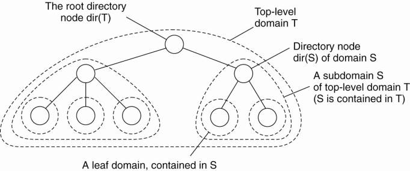
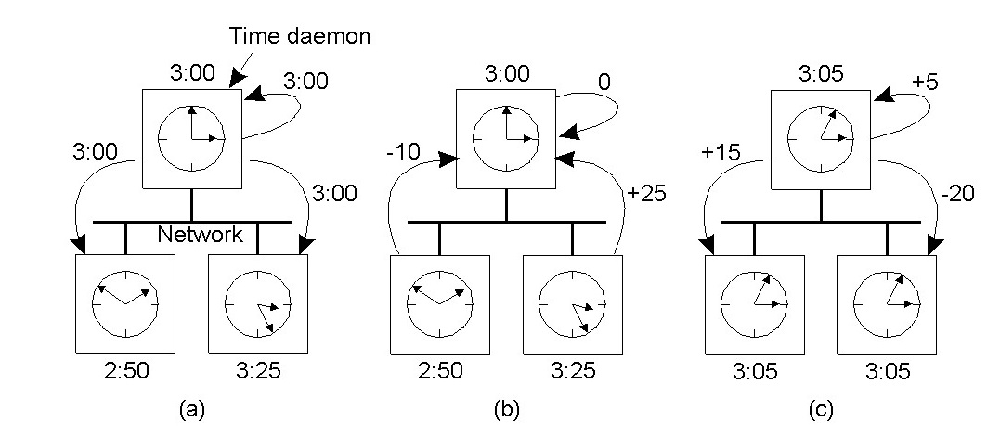

# Hệ phân tán
## Chương 1: Tổng quan
### 1. Định nghĩa
> hệ phân tán là hệ thống các máy tính độc lập kết nối lẫn nhau bằng mạng máy tính cung cấp một dịch vụ thống nhất cho người dùng như một máy tính đơn nhất

### 2. Đặc điểm
#### 2.1. Chia sẻ tài nguyên
Đây là mục tiêu quan trọng nhất cũa hệ phân tán, đảm bảo các tiến trình ở các máy tình khác nhau có thể sử dụng tài nguyên của nhau. Giảm thiểu chi phí lưu trữ tài nguyên, tăng tính sẵn có, nhưng đồng thời cũng tăng rủi ro về an toàn thông tin.
#### 2.2. Tính trong suốt
Là sự che dấu với người dùng cuối sự rời rạc, quy mô và vị trí của hệ thống, nhờ đó , đối với người dùng, hệ thống là duy nhất. Cần cân bằng giữa mức độ trong suốt và hiệu năng của hệ thống.

Các loại trong suốt, dùng để che dấu những thành phần khác nhau: trong suốt truy cập (sự bất đồng về biểu diễn và truy cập tài nguyên), trong suốt vị trí (vị trí tài nguyên), trong suốt di trú (khả năng di chuyển tài nguyên), trong suốt chuyển địa điểm (sự di chuyển tài nguyên khi đang sử dụng), trong suốt sao lưu (tình trạng sử dụng bản sao), trong suốt tương tranh, trong suố sự cố, trong suốt bền vững (lưu trong bộ nhớ ngoài hay bộ nhớ chính)

#### 2.3. Tính mở

Một hệ thống được gọi là mở nếu nó cung cấp dịch vụ theo các quy tắc được đặc tả bằng chuẩn cú pháp và ngữ nghĩa nhất định gọi là **giao diện**. Nhờ vậy, các thành phần của hệ thống có thể được cung cấp bởi các NSX khác nhau, miễn là phù hợp với giao diện của hệ thống.  Ngôn ngữ thường được sử dụng là IDL (interface description language)

* Khả năng phối hợp:  các cài đặt của hệ thống hoặc thành phần hệ thống từ các nhà sản xuất khác nhau có thể làm việc với nhau  

* Tính khả chuyển: một ứng dụng được phát triển cho hệ phân tán A có thể cài đặt mà không cần thay đổi gì trên hệ phân tán B khác, với điều kiện B có giao diện tương đống với A

* Tính mềm dẻo có thể mở rộng đươc
#### 2.4. Tính co dãn
Môt hệ phân tán phải thích nghi với sự thay đổi quy mô của hệ thống. Thể hiện trên các khía cạnh:

* dễ dàng bổ sung người sử dụng và tài nguyên hệ thống
* Thay đổi hoặc tăng quy mô về vị trí địa lý, phải đảm bảo trao đổi thông tin trên mạng diện rông như trên mạng cục bộ (tốc độ, độ tin cậy, đỗ trễ, đồng bộ hay ko đồng bộ, ...)
* Thay đổi quy mô về tổ chức quản trị

Giải pháp: Chia nhỏ (vd: DNS) 

### 3. Các thành phần hệ phân tán

#### 3.1. Phần cứng

##### a. Hệ đa vi xử lý

* Các bộ vi xử lý kết nối với nhau và với modun nhớ thông qua trục bus của hệ thống -> khi một cặp sử dụng trục thì cặp khác không sử dụng được -> tăng thời gian chờ
* Kiến trúc switch trung gian -> hiệu năng cao -> chi phí cao
* Mini computer: ít tiền, mỗi cpu sử dụng bộ nhớ riêng, yêu cầu các máy tính tương đối giống nhau

##### b. Hệ thuần nhất / hệ không thuần nhất

* Hệ thuần nhất: các máy tính tương đối giống nhau, thường sử dụng trong tính toán song song

* Hệ không thuần nhất: những máy tính khác nhau kết nối với nhau

#### 3.2. Hệ điều hành phân tán

##### a. Dos (Distributed OS)

Hệ điều hành duy nhất được cài đặt trên tất cả hệ thống phần cứng của hệ thống,  các vấn đề của hệ phân tán được xử lý ở tầng hệ điều hành. Người sử dụng không cần quan tâm đến các chi tiết của hệ phân tán, múc trong suốt tuyệt đối. 

##### b. NOS (Network OS)

Bổ sung thêm các tính năng vào các hệ điều hành cục bộ, cho phép tiến trình có thể sủ dùng hạ tầng mạng máy tính để kết nối và giao tiếp với nhau. Người xây dựng ứng dụng phải cung cấp các cơ chế để trao đổi thông tin với nhau (UDP, TCP, ..). người xây dựng ứng dụng phải xử lý những vấn đề của hệ phân tán. Thường dùng cho các hệ không thuần nhất.

##### c. **Middleware** 

Nằm giữa nos và tầng ứng dụng phân tán. Là các thư viện các framework cung cấp các cơ chế giao tiếp trao đổi trong hệ phân tán, cho phép lập trình viên sử dụng để phát triển ứng dụng như môt thư viên có sẵn mà không phải lâp trình lại. Tức là trong trường hợp lý tưởng, hệ thống sẽ trở nên trong suốt đốio với người xây dựng ứng dụng!

MiddleWare cung cấp các dịch vụ:

- Truy cập trong suốt 
- Các phương tiện trao đổi thông tin bậc cao 
- Dịch vụ định danh 
- Dịch vụ lưu trữ bền vững 
- Giao tác phân tán 
- Bảo mật 
- Các dịch vụ khác

Có thể nói MiddleWare thừa kế những ưu điểm tử cả DOS (tính trong suốt cao) và NOS (tính mở, tính co giãn cao)

## Chương 2: Kiến trúc
### 1. Giới thiệu
#### 1.1. Kiến trúc

Hệ phân tán được phân chia thành các thành phần nhỏ, kiến trúc là sự mô tả cách tổ chức và tương tác giữa các thành phần. Mỗi thành phần được gọi là đơn vị module, với giao diện được định nghĩa và cung cấp rõ ràng nằm trong môi trường của chúng. Với giao diện tương đồng thì có thể kết nối và thay thế lẫn cho nhau. Các thành phần được kết nối vs nhau = các connecter, chính là các phương tiện để thực hiện các lời gọi thủ tục truyền thông điệp hay dữ liệu dòng.

Kiểu kiến trúc:

* Cách thức các thành phần kết nối với nhau
* Cách thức dữ liệu trao đổi giữa các thành phần
* Các thành phần kết hợp như thế nào để tạo nên một hệ thống

##### 1.1.1.Phong cách phân tầng

ý tưởng: tổ chức thành phần theo phân tầng: tầng $L_i$  có thể sử dụng được các module ở tầng $L_{i-1}$

Tác dụng:

* đối với các hệ thống phức tạp, áp dụng nguyên lý chia để trị
* cho phép xác định rõ nhiệm vụ của các bộ phận và quan hệ giữa chúng
* dễ dàng bảo trì vả nâng cấp hệ thống, thay đổi thành phần này không ảnh hưởng đến thành phần khác (vd: khi chuyển từ ipv4 -> ipv6 chỉ quan tâm đến tầng mạng, ko ảnh hưởng đến các tầng khác)

##### 1.1.2. Phong cách hướng đối tượng 

Các thành phần là các đối tượng, các kết nối là các lời gọi thủ tục, cơ chế kết nối là cơ chế lời gọi thủ tục. Bao gồm 2 loại đối tượng là khách (object client) và chủ (Object server).

Kết nối giữa các đối tượng là kết nối lỏng, tức là chúng có thể không đồng, khác nhau về các phương thức hay thuộc tính. 

##### 1.1.3. Phong cách hướng sự kiện

Các thành phần hệ thống trao đổi thông tin với nhau thông qua các sự kiện, các sự kiện có thể kích hoạt các thao tác thông qua các tiến trình. Kết nối giữa các đối tượng là kết nối lỏng, các thành phần có thể khác nhau về cả phần cứng lẫn phần mềm. 

##### 1.1.4 Kiến trúc hướng dữ liệu

Các tiến trình có thiết kế tách rời, trao đổi thông tin qua một kho dữ liệu chung, vì vậy 2 tiến trình không đồng thời cùng chạy vẫn có thể trao đổi dữ liệu.

#### 1.2. Mô hình

là kết quả của sự trìu tượng hoá hpt. Có 3 loại:

* Mô hình lỗi
* Mô hình tương tác
* Mô hình bảo mật

### 2. Kiến trúc hệ thống
#### 2.1. Kiến trúc tập trung
##### 2.1.1 Client-Server

* Client:  Là 1 tiến trình sử dụng dịch vụ của server bằng cách gửi yêu cãu, nhận kết quả và hiển thị
* Server: Là 1 tiến trình triển khai 1 dịch vụ cụ thể. Lằng nghe, nhận yêu cầu, xử lý và trả lời
* Giao thức kết nối: Hướng kết nối hoặc ko kết nối

##### 2.1.2 Phân tầng ứng dụng

Thay vì phân biêt client server thì chuyển sang phân biệt các tầng,

* tầng giao diện người dùng: cung cấp chương trình cho người dùng cuối tương tác vs hệ thống
* tầng nghiệp vụ
* tầng dữ liệu

#### 2.2. Kiến trúc phi tập trung

Phân phối các client và server chia 1 cách vật lý các phần việc tương ứng, được gọi là phân phối ngang.

##### 2.2.1 p2p có cấu trúc

> **Mạng Overlay**: Được xây dựng bên trên hệ thống mạng vật lý thật, mỗi node là 1 tiến trình và các cạnh là các kênh liên lạc có thể của tiến trình đó. 

Tên tệp được mã hoá bằng DHT (distributed hash table) thu đươc 1 dãy 128 bit, vấn đề cần giải quyết là cung cấp thủ tục routing (thầy gọi là phân vùng khoá) tìm ra địa chỉ mạng của node chịu trách nhiệm khi tìm kiếm têp tin.

**Chord System**:

* succ(key) = id nhỏ nhất lớn hơn key
* lookup(key) : trả về succ(key)
* thêm node: thêm ngay sau succ(id mới), sau khi thêm gán lại succ(key) cho các key cũ
* xoá node: ngược lại

**Content Address Network(CAN)**:

##### 2.2.2. p2p không câu trúc

Mỗi node có 1 list các node hàng xóm, dữ liệu được lưu trữ môt cách ngẫu nhiên, vì vậy khi muồn tìm kiếm phải truy vấn toàn bộ mạng

#### 2.3. Kiến trúc hỗn hợp

##### 2.3.1. Máy chủ biên

Server triển khai ở biên mạng (danh giới cùa mạng doanh nghiệp và mạng internet). Các cient có thể lấy nội dung mà không cần kết nối đến nhà cung cấp nội dung.

##### 2.3.2 Hệ phân tán hợp tác

Kết hợp giữa kiến trúc tâp trung và không tâp trung. Sử dụng hệ thống tập trung để tìm kiếm file torrent, lấy list các node tracker đang lưu giữ tập tin cần tải. Sử dụng hệ thống phi tập trung để tải và seed file.

## Chuơng 3: Tiến trình và luồng

### 1. Tiến trình và luồng

#### 1.1. Giới thiệu

* Tiến trình: Một chuơng trình đang chạy trên một bộ xử lý ảo. HDH làm cho hoạt động của các tiến trình là trong suốt vs nhau bằng cách tạo ra không gian địa chỉ độc lập, ...

* Luồng: là một hay một phần chương trình đang thực hiện, các luồng không nhất thiết phải trong suốt với nhau, chia sẻ ngữ cảnh với nhau, nó coi hiệu năng là quan trọng.

* Lời gọi hệ thống (System call): là tập lệnh mở rộng do hệ điều hành cung cấp xác định giao diện giữa hệ điều hành và các chương trình người sử dụng.

* Blocking System call: là lời gọi hệ thống mà sau khi được gọi bởi tiến trình người sử dụng thì tiến trình này bị dừng lại cho đến khi thực hiện xong lời gọi hệ thống.

#### 1.2. Luồng trong các hệ thống tập trung 

Lợi ích của đa luồng:

* Tránh dừng cả tiến trình với 1 lời gọi hệ thống dừng

* Khai thác đa vi xử lý, tăng hiệu năng cho hệ thống 

* Hữu dụng trong các chuơng trình lớn

* module hóa các phần mềm

Cách thức cài đặt luồng: **user-mode**(tạo bộ thư viện và xây dựng và quản lý luồng thực hiện bởi user) và **kernel-mode** (xây dựng và quản lý luồng ở tầng kernel). Đối với user-mode, lời gọi hệ thống sẽ làm dừng tòan bộ theard thuộc tiến trình đang chạy. Đối với kernel-mode, chi phí cho các thao tác rát lớn , mất hết lợi ích vể hiệu năng khi sử dụng đa luồng. Giải quyêt bằng cách sử dụng **tiến trình nhẹ**. 

Với cơ chế này, mỗi tiến trình đơn có nhiều tiến trình nhẹ. Mỗi tiến trình nhẹ lại có thể tạo và quản lý luồng ở tầng user. Khi 1 tiến trỉnh nhẹ đuợc tạo ra nó đi tìm luồng thích hợp để chạy (mỗi tiến trình nhẹ có 1 bảng lùông). Nếu 1 luồng bị dừng, nó thực hiện lời gọi lập lịch. Khi có lời gọi hệ thống dừng, chỉ dừng môt tiến trình nhẹ, hệ điều hành sẽ chuyển ngữ cảnh sang tiến trình nhẹ khác.

#### 1.3. Luồng trong các hệ thống phân tán.

* Server đơn luồng: Chỉ có thể xử lý được một yêu cầu tại một thời điểm, các yêu cầu khác đuợc xếp vào hàng đợi và xử lý tuần tự. => trong suốt yếu.

* Server đa luồng: Trao đồi thông tin có thể tiến hành song song với các xử lý khác. Các luồng chính: Nhận các yêu cầu, xử lý yêu cầu, trả về cho client.

	* Server có điều phối: 1 luồng chuyên biệt dùng để nhận yêu cầu và chỉ ra luồng nào sử lý công việc nào.
	
	* Các kiến trúc khác: TheardPerRequest (ko cần hàng đợi, max băng thông nhưng giảm hiệu năng), TheardPerConnection, TheardPerObject;

* Máy trạng thái: 1 luồng lưu trạng thái ra ổ đĩa.

* Client đa luồng: 2 loại luống : hiển thị và xử lý.

### 2. Ảo hóa

#### 2.1. giới thiệu:

Đầu tiên dùng để mô tả phần cứng, sau đó chuyển sang mô tả phần mềm.

Ý tuởng: Giả lập môi truờng làm việc của hệ thống này trên môi truờng làm việc của hệ thống khác 

4 Mức khác nhau của giao diện:

* Nằm Phần cứng và phần mềm,  đuợc gọi bởi bất kì phần mềm nào

* Nằm Phần cứng và phần mềm chỉ đuợc gọi bởi OS

* Các lời gọi hệ thống (thư viện và OS) 

* Các thư viện (application và thư viên)

#### 2.2. Các kiến trúc ảo hóa 

* Máy ảo tiến trình: Run time System: Cung cấp các tập lệnh trìu tuợng để có thể chạy chuơng trình. Các tập lệnh có thẻ6 chạy bằng thông dịch hoặc giả lập như đã chạy. VD: java 

* Kiến trúc kiển sóat: 1 tầng hòan tòan che phủ phần cứng, cung ứng 1 tập lệnh đầy đủ như 1 giao diện, cho phép chạy nhiều hệ điều hành khác nhau trên 1 hệ thống. VD: các ứng dụng máy ảo

### 3. Di trú mã 

#### 3.1. Lý do:

* Hiệu năng: cân bằng tải 

* Mềm dẻo

#### 3.2. Di trú mã
1 tiến trình: Mã, tài nguyên , trạng thái 

* Week Mobility: Mã và giá trị khởi tạo 

* Strong Mobility: gửi thêm trạng thái hiện tại 

#### 3.3. Liên kết tài nguyên

* Bằng định danh

* Bằng giá trị

* Bằng kiểu dữ liệu 

Đối với các hệ thống không đồng nhất, việc thực hiện mã rất khó khăn phải dịch lại mã 

### 3. Client

#### 3.1. Networked User Interfaces

Cung cấp phương tiện để người dùng tương tác với máy chủ từ xa.

**X Window System**:

Dùng để điều khiển các thiệt bị đầu cuối ánh xạ theo bit, bao gồm màn hình, bàn phím và chuột. X có thể xem như là 1 phần của hệ điều hành để diều khiển phần cứng. Trái tim của X là X-kernel, nó cung cấp 1 interface level thấp X-lib dùng để điều khiển màn hình và capture thông tin từ chuột cũng như bàn phím. Điều tuyệt vời của X-system là X-kernel và X application không nhất thiết phải cài trên 1 máy. X-lib sẽ bắt các sự kiện (kích chuôt, gõ chữ) gửi về cho X-kernel, X-kernel sẽ xử lý và phản hồi về cho X-lib rồi truyền lên tầng ứng dụng. Giao thức này goi là 1 X-protocol vá là 1 giao thức ở tầng ứng dụng.

## Chương 4: Trao đổi thông tin

### 1. Cơ Bản 

#### 1.1. Các giao thức phân tầng

Phải thống nhất về các mặt: cấu trúc thông điệp, cơ chế phát hiện lỗi, kích cỡ dữ liệu và sự thống nhất của thông điệp gọi chung là giao thức

Mô hình OSI (Open System Interconection): 

Trao đổi thông tin chủ yếu dựa vào 2 thao tác: gửi và nhận. Có thể đồng bộ hoặc bất đồng bộ

* đồng bộ: Gửi và nhận đều là thao tác dừng, tiến trình sẽ dừng cho đến khi thông điệp nhận
* Không đồng bộ: Tiến trình ko bị dừng, dùng bộ đệm cho phép chạy nền để nhận vả gửi thông điệp

Đích đến của thông điệp : Cặp IP và port, 

#### 1.2. UDP

Không hướng kết nối, không tin tưởng và không đồng bộ

* Server: Nhận yêu cầu, lấy IP va Port của Client, gửi trả lời
* Client: Gửi và nhận

Vấn đề: sent() ko phải phương thức dừng, recieve() bị dừng, kích cỡ thông điệp, timeout.

#### 1.3. TCP

Hướng kết nối, đáng tin cậy.

Bắt tay 3 bước: A gửi SYN, B nhận SYN gửi ACKSYN, A nhận ACKSYN gửi ACK

Kết thúc: A gửi FIN, B nhận FIN gửi ACK, B ngắt kết nối, gửi FIN, A nhận FIN, gửi ACK, B nhận ACK và đóng kết nối.

### 2. Lời gọi thủ tục từ xa
Một cải tiến trong hệ phân tán là gộp tầng trình diễn và tầng phiên thành một tầng mới là tầng middle ware. Do đó ta cũng phải xây dựng các giao thức tương ứng cho tầng middleware này.

Có 4 mô hình dịch vụ middleware :

- Gọi thủ tục từ xa RPC (Remote Procedure Call).
- Triệu gọi đối tượng từ xa (Remote Object Invocation)
- Middleware hướng thông điệp (Message – oriented Middleware)
- Middleware hướng dòng (Stream – oriented Middleware)

#### 2.1. Giao thức yêu cầu trả lời

Sử dụng 2 loại thông điệp để giao tiếp là hỏi và trả lời. Ưu điểm là không cần báo nhận (ACK) vì đã có trả lời, Đồng bộ. Các thủ tục:

* doOperation()
* getRequest()
* sentReply()

VD: HTTP

Các cách thức:

* RR
* RR(request-reply)
* RRA(request-reply-ack)

#### 2.2. Lời gọi thủ tục từ xa

Che dấu những khía cạnh quan trọng để đạt được độ trong suốt cao nhất:

* mã hoá và giải mã các tham số và kết quả
* Truyền thông điệp
* giữ lại các ngữ nghĩa cần thiết cho việc truyền thủ tục

Về việc truyền tham số, tham trị ko gặp nhiều vấn đề, đối với tham trị, sử dụng cơ chế copy phục hồi.

Thủ tục như 1 interface, quá trình thực hiện là trong suốt với lập trình viên, lập trình viên không hề biết thủ tục đang được thực hiện ở server.

Trong mô hình client – server thì lời gọi thủ tục từ xa được thực hiện qua các bước sau:

1. Tiến trình muốn thực hiện thủ tục ở máy client sẽ gọi client stub.
1. Client stub sẽ tạo một bản tin và có lời gọi đến hệ điều hành của client đó.
1. Hệ điều hành của máy client sẽ gửi bản tin đó tới hệ điều hành của máy server.
1. Hệ điều hành của server sẽ gửi bản tin tới server stub.
1. Server stub lấy các thông tin của gói tin và gọi chương trình con tương ứng.
1. Server thực hiện công việc được yêu cầu và trả kết quả về cho server stub.
1. Server stub đóng gói kết quả đó vào bản tin rồi gọi hệ điều hành của server đó.
1. Hệ điều hành của máy server này sẽ gửi bản tin kết quả đó hệ điều hành của máy client.
1. Hệ điều  hành của máy client sẽ gửi bản tin cho client stub.
1. Client stub sẽ mở gói tin kết quả và trả về cho client. 

Cơ chế truyền tham trị sẽ gặp các vấn đề: khác nhau kiểu dữ liệu hay khác kiểu dữ liệu. VD: biễu diễn số theo kiểu little radian và big radian.Cơ chế truyền tham số bằng tham chiếu, con trỏ không có giá trị, giải quyết = sao chép và phục hồi. Tuy nhiên lại Khó áp dụng cho dữ liệu có cấu trúc. 2 bên gửi và nhận cùng phải thống nhất về các đặc tả tham số (tuân thủ 1 kiểu giao thức): Định dạng thông điệp, Các biễu diễn các cấu trúc dữ liệu đơn giản, kiểu trao đổi thông điệp, triển khai server và client stub, các stub khác nhau gửi interface giao tiếp vs ứng dụng, 1 interface bao gồm các thủ tục có thể gọi ở client và thực hiện trên server thường được mô tả bằng IDL (viết = cùng ngôn ngữ vs client hoặc server) , và biên dịch thành server stub hoặc client stub. Đối với các kiểu dữ liệu struct, dùng các đặc tà như CORBA, XML,..

**RPC Không đồng bộ**: Có những trường hơp RPC ko cần trả lại kết quả nên sau khi client gọi RPC sẽ tiếp tục thực hiện mà không quan tâm đến kết quả trả lại.

**Xây dựng chương trình RPC**:

1. Định nghĩa giao diện 
2. IDL comlier -> Client stub và server stub, header
3. đưa về server và client, viết code và biên dịch = Linker

#### 2.3. Lời gọi phương thức từ xa

Có thể khai thác các điểm mạnh của lập trình OOP và có thể truyền các đối tượng thay vì các biến. Môt đối tượn từ xa phải có interface đặc tả các thủ tục của mình để các đối tượng khác có thể gọi.

### 3. Trao đổi thông tin hướng thông điệp

Bản chất của RPC, đó là client và server phải cùng đang hoạt đông và client bị khoá cho đến khi yêu cầu của nó được xử lý, cần phải thay thế bằng thứ khác. 

#### 3.1. Tạm thời

Bản tin gửi đi chỉ được lưu lại trong phiên truyền thông đó. Khi phiên truyền thông đã hoàn thành hoặc khi kết nối bị hủy bỏ thì các bản tin đó cũng bị hủy bỏ trên các server. Do đó, vì một lý do nào đó mà một server trung gian không thể chuyển tiếp bản tin đi được thì bản tin này sẽ bị hủy bỏ.

**Socket**: Điểm cuối truyển thông cho phép ừng dụng có thể ghi dữ liệu và đọc dữ liệu qua mạng. Các hàm socket nguyên thuỷ: Đối vs Server: Socket() khởi tạo, bind() gán đia chỉ, listsen() hàm nghe ko dừng, accept() hàm nghe dừng; Đối vs client 
Socket(), connect() hàm dừng, sau đó 2 bên sẽ trao đổi: send() và receive(). Kết thúc là close().

Socket không đủ mức trìu tượng và ko thích hợp với mạng tốc đô cao (do dùng TCP/IP).

**MPI**:Chuẩn về truyền thông điêp MPI (Message-Passing Interface) . MPI được thiết kế cho các ứng dụng song song và truyền thông điêp tạm thời. MPI coi việc truyền thông diển ra trong tiến trình, nhóm tiến trình, và gán mỗi nhóm tiến trình môt định danh thay vì sử dụng đia chỉ tầng giao vận như socket.

#### 3.2. Bền vững

**MOM**: Hệ thống hàng đợi thông điêp hỗ trợ trao đổi thông tin không đồng bộ bển vững , hỗ trợ lưu trữ thông tin cho bên gửi và bên nhận. 2 bên không cần cùng hoạt đông lúc truyền thông điêp. Bên gừi chi được đảm bảo lả thông tin đã lưu vào hàng đơi mà không được đảm bảo là bên nhận có nhận được thông tin hay không.

Cần lưu lại vị trí các hàng đợi, tương tự như DNS. Các đơn vị quản lý hàng đợi, có 1 số đơn vị hoạt đông như 1 route vì nhiều khi hệ thống hàng đơi khá lớn, không thể lưu trữ trong 1 bảng. 

Không thể sử dụng định dang chung thông điêp -> sử dụng 1 node có tên là message broker để chuyển đổi thông điêp để bên nhận có thể đọc được. Message Broker hoạt đông nhứ ứng dụng và cũng có hảng đợi riêng.

### 4. Trao đổi hướng dòng

Trao đổi các thông tin theo thời gian liên tiếp, vd: audio, video, ...

#### 4.1. Dòng dữ liệu liên tục
 
Để chạy 1 file audio phải thiết lập 1 dòng dữ liệu liên tục đồng bộ về thời gian, có giới hạn độ trễ thời gian.  Thời gian chuyển qua mạng < khoảng cách lấy mẫu. Dòng dữ liệu đơn chỉ gồm 1 chuỗi dữ liệu, dòng phức thì gồm nhiều dòng đơn. Chuyển tin đẳng thời: tất cả dòng phải truyền trên 1 ngưỡng thời gian cho trước.

 **Qos**: Module kiểm tra đảm bảo chất lượng dịch vụ

#### 4.2. QoS

Mô tả cơ chế cần thiết để mối quan hệ rằng buộc về thời gian được đảm bảo. Đàm bảo các yêu cầu: bitrate, delay, e2e delay, jilter, round trip dela

Cơ chế phân lớp gói tin theo mức độ ưu tiên, các router lấy đó làm cơ sở truyền gói tin đi. Cơ chế sử dụng bộ đệm để giảm jilter, bộ sử dụng bên nhận, nhận 1 số gói tin trước rồi mới truyền cho ứng dụng. Cơ chế truyền xen kẽ: Đảo các thứ tự đễ phân tán thiệt hại, làm giảm độ gián đoạn của dữ liệu.

#### 4.4 Đồng bộ hoá dòng

Duy trì mối liên hệ thời gian giữa các dòng dữ liệu đơn. Đồng bộ hoá dựa trên đơn vị dữ liệu. Cần xem xét cơ chế cơ bản để đồng bộ 2 dòng và sự phân bố cơ chê đó trong một môi trường mạng.

Ở mức đơn vị dữ liệu. có 1 tiến trình chuyên đọc ghi đơn vị dữ liệu để đảm bảo các rằng buộc về thời gian. Tuy nhiên ứng dụng hoàn toạn chịu trách nhiệm đồng bộ hoá trong khi nó chỉ có các công cụ cáp thấp. 

Để giải quyết vần đề này, người ta cung cấp 1 middleware chứa các công cụ để đồng bộ dòng dễ dàng hơn. Ứng dụng chỉ cần gọi các method đã được cung cấp sẵn để đồng bộ hoá.

## Chương 5: Định Danh

### 1. Tên, định danh và thực thể.

**Tên**: là các xâu bit hoặc kí tự dùng để tham chiếu đến 1 thực thể trong hệ phân tán. Cơ chế truy cập từ tên đến thực thể gọi là **hệ thống định danh**. Môt thực thể có thể có nhiểu tên. Để sử dụng 1 thực thể, cần access nó thông qua **access point**. Access point là 1 thực thể đặc biệt, tên chính lả địa chỉ của nó. Địa chỉ của 1 access point chính là địa chỉ của thực thể của access point đó. 1 thực thể có thể có nhiều access point và có thể thay đổi access point. Có nhiều tên -> ko biết dùng tên nào -> Sử dụng **định danh**.

Định danh:

* chỉ đến nhiều nhất 1 thực thể
* 1 thực thể chỉ có 1 định danh
* ko đổi

địa chỉ ko phải định danh. Các vấn đế: Định danh cảu các thực thể ko còn tồn tại, tái sử dụng định danh và cạn kiệt định danh. 

1 số vd của định danh: URI, URL (URI cho phép mô tả phương thức truy cập) , URN, ...

**Dịch vụ tên**: lưu trữ thông tin về các thực thể, phân giải tên. Yêu cầu: Quy ô vô hạn, chịu được các sự thay đổi, sẵn có và chịu được các rủi ro về bảo mât. vD: Hệ thống tệp linux, DNS, ...

### 2. Kiểu đặt tên phẳng

Là chuỗi bit không có cấu trúc, không có access point để tìm địa chỉ -> cơ chế phân giải tên sang địa chỉ.

#### 2.1. Các giải pháp thông thường

##### 2.1.1. Quảng bá

Điều kiện thục hiện: Hệ phân tán hỗ trợ trao đổi thông tin thông qua quảng bá. Đưa ra 1 thông báo hỏi tới tất cả thực thể, thực thẻ nào đúng sẽ quãng bá 1 thông báo chừa đinh danh và đia chỉ của mình.vs ARP. -> tốn tài nguyên -> sử dụng thông báo nhóm. Vấn đề: ko có cơ chế xác thực.

#### 2.1.2. Chuyển tiếp con trỏ

Xuât phát điểm tất cả các thực thể đều có thông tin ánh xạ giữa tên và đia chỉ của các thực thề ánh cạ khác. Khi các thực thể thay đổi địa chỉ, sẽ để lại tham chiếu mới tại đoạ chỉ cũ cho các thực thể khác có thể truy cập. Sau quá trình vận hành, các thực thể sẽ tham chiếu đến nhau thông qua môt chuỗi các con trỏ. 

Nhược diểm: Chuỗi tham chiếu dài, mất dấu khi con trỏ hỏng. Giải quyết bằng cách tạo shortcut và loại bỏ con trỏ.

#### 2.2. Home-Based

Lưu trữ vị trí hiện tại của thực thể (thường là tại nơi tạo ra thực thể). Nhược điểm: phải liên lạc với home base trước, rất mệt mỏi. Vị trí của Home based là tĩnh. 

#### 2.3. Bảng băm phân tán:

Hệ thống Chorch. succ(k): id nhỏ nhất lớn hơn k. Thực thể k sẽ được quản lý tại node succ(k).

Giả sử định danh = m bit, tạo một node p lưu 1 finger table với m phần tử FT(p,i) = succ(p + 2^(i-1)). Khi tìm cần tìm thực thể x qua mạng, nó sẽ so sánh trong bảng finger table và nhảy tới node gần x nhất.

#### 2.4. Giải pháp phân cấp

Mạng chia ra làm tập hợp các domain, domain đỉnh đơn là domain lớn nhất kết nối với toàn bộ mạng mỗi domain có thể chia ra làm các subdomain. Mỗi domain sẽ kiểm soát tất cả các thành viên trong domain đó -> Dạng cây thư mục. Nút root có thông tin về mọi thành viên trong thực thể của mình.

Đối với trường hợp có 2 địa chỉ, node nhỏ nhất bao gồm 2 địa chỉ chứa bảng ghi thông tin vị trí cho node đó và chứa 2 con trỏ đến 2 vị trì.

Quá trình tìm kiếm: ngược từ nút lá đến nút cha đến khi tìm thấy node có thông tin thực thề. -> Tìm kiếm cục bộ, mở rộng dần bán kính tìm kiếm.

Cập nhập: chuyển dần ngược lên cho đến khi tìm được node chứa thông tin thực thể gốc rồi cập nhập tạo đó sau đó truyền ngược trở lại.

Lưu trữ thông tin trong bộ đệm là hiệu quả đối vs các thực thể ít dịch chuyển hoặc chỉ dịch chuyển trong domain.

* Loại bỏ bớt tên không dùng:

	* Danh sách tham chiếu: Trước khi hoạt động phải đăng kí thời hạn sử dụng, khi hết thời hạn, có thể gán cho thực thể khác.
	* Phát hiện các thực thể ko kết nối: Theo dõi tham chiếu, nếu ko có tham chiếu thì loại bỏ, tìm các node không thể tham chiếu được từ root.
	* Con đếm tham chiếu: Mỗi khi có tham chiếu đến +1, nếu bỏ thì -1 -> hệ phân tán bị đếm 2 lần và đếm chậm.

### 3. Không gian tên có cấu trúc

#### 3.1. Không gian tên

Các tên được tổ chức vào các đồ thị có hướng, gồm 2 loại node: node lá và node thư mục. Mỗi node được xem như 1 thực thể, Node thư mục lưu trữ 1 bảng, mỗi nhánh đi ra lưu trữ 1 cặp thông tin nhãn vả định danh của node đó. Đường dẫn là 1 chuỗi các node nằm trên đường đi. 1 node có thể có nhiều đường dẫn đến nó.

#### 3.2. Phân giải tên

Đi từ từ lần lượt để tìm các node cha.

vd: Hệ thống thư mục unix: Liên kết vật lý, liên kết biểu tượng, ...

**Mounting**: Môt Dir node sẽ lưu trữ một dir node ở không gian tên khác.

**Merging**: tạo node root mới để ghép 2 không gian tên thành 1 không gian tên mới.

#### 3.3. Cài đặt không gian tên

##### 3.3.1. Dịch vụ tên:

Chức năng: Đăng kí, tìm kiếm va phân giải. Được lưu trên nhiều máy khác nhau. Việc phân tán không gian tên được tổ chức theo mô hình phân cấp: Mức toàn thể(rất ít thay đổi), mức quản trị, mức quản lý.

##### 3.3.2. Phân giải tên

* Không đệ quy: Từng Server gửi server mức dưới cho bộ phân giải tên đặt tại client. 
* Đệ quy: Chỉ gửi yêu cầu 1 lần, các server tự tìm nhau đến node cuối cùng rồi mới gửi lại cho bộ phân giải tên ở client. Sử dụng bộ đệm hiệu quả cà giảm chi phí trao đổi thông tin (chí lấn) nhưng lại yêu cầu hiệu năng server cao.

### 4. Dựa trên thuộc tính

#### 4.1. Dịch vụ thư mục

Việc chọn lựa các tạp thuộc tính chung phù hợp lá rất khó -> RDF cho phép định nghĩa thuộc tính tự động.

#### 4.2. LDAP

Giao thức truy cấp cấu trúc thư mục (tập hợp các đối tượng có đặc điểm tương tự). Là 1 giao thức hướng thông điệp.

## Chương 6: Đồng bộ

Mục đích:

* Phục vụ truy cập tài nguyên chung, tránh tương tranh
* Thứ tự các sự kiện, đảm bảo các tiến trình thực hiện đúng thứ tự 

### 1. Đồng bộ hoá thời gian

#### 1.1. Khái niệm

Trong hệ tập trung, dùng đồng is very easy, trong hệ phân tán không có đồng hố vật lý đặc trưng. VD: khi make file, chỉ dịch những file .c chỉ dịch những file có thời gian ghi tài liệu > file .o .

#### 1.2. Thời gian vật lý

Chúng ta có nhiều cách để xác định thời gian.Phổ biến nhất là các hệ đếm thời gian theo thiên văn và ở đây là mặt trời.Có 23h một ngày và 3600 giây.Một giây mặt trời được tính là 1/3600 của một ngày mặt trời.Một trong những mô hình để tính thời gian áp dụng phương pháp trên là Internatinal Atomic Time viết tắt là TAI. Tuy nhiên, TAI lại có một vấn đề là cứ 86400TAIs sẽ có 3ms chậm hơn so với đồng hồ mặt trời.

Để thống nhất thời gian vật l‎ người ta đã đưa ra khái niệm thời gian phối hợp toàn cầu UCT (Universal Coordinate Time). Viện chuẩn quốc gia Mỹ đã lập ra trạm phát radio sóng ngắn W W V để gửi UTC khi cần hoặc định kì.
 

#### 1.3. Thuật toán đồng bộ thời gian

Nếu tất cả các máy tính đếu có thể sử dụng WWV thì mọi thứ đếu dễ dàng vì tất cả đều chuẩn. Nhưng trong trường hợp không thể thì có thể sử dụng các giải thuật sau:

##### 1.3.1. Giao thức thời gian mạng

Chỉnh đồng hồ của client về theo đồng hồ của server.

Độ chênh lệch = (( T2 - T1 ) + ( T3 - T4)) / 2

##### 1.3.2. Giải thuật Berkeley

##### 1.3.4. Giải thuật đồng bộ trong mạng định tuyến

2 giải thuật trên không thể áp dụng vì việc gửi gói tin trong mạng không dây là rất tốn năng lượng.

**RBS**: Đồng bộ quảng bá tham chiếu: đồng bộ hoá thời gian cục bộ, sender không tham gia hiệu chỉnh thời gian mà chỉ có nhiệm vụ gửi các gói tin cục bộ đến tiến trình khác. Dựa vào thời điểm nhận gói tin cục bộ, retriever tính được độ lệch thời gian của mình so với các máy cục bộ khác.

### 2. Đồng hồ logic

Chỉ quan tâm đến quan hệ trước sau chứ không quan tâm đến giá trị thời gian đúng

#### 2.1. Đồng hồ Lamppost

**quan hệ xảy ra trước**: A và B là những sự kiện của cùng 1 tiến trình (vd gửi và nhận thông điệp) thì kí hiệu : **A->B**, A-> B , B -> C thì A -> C

m1 và m2 đã thoả mãn, m3 và m4 thì không -> hiệu chỉnh thời gian t3=t3'+1. Việc thực hiện đều chỉnh này thực hiện ở middleware. Đồng hồ logic Lamppost chưa giải quyết được mối quan hệ nhân quả của các tiến trình -> sử dụng đồng hồ vector.

#### 2.2. Đồng hồ vector

Tiến trình Pi quản lý một vector VCi thoả mãn:

* VCi[i] : đồng hồ logic cục bộ của tiến trình Pi
* Vci[j] : chi thức của Pi vế thời gian cục bộ của Pj

Thuật toán:
	
1. Trước khi thực hiện 1 sự kiện Pi tiến hành: VCi[i] = VCi[i] + 1
2. Khi Pi gửi thông điệp m cho Pj, đặt ts(m) = VCi
3. sau khi nhận, Pj sẽ hiệu chình VCj[k] = max(VCj[k], ts(m)[k]) với mỗi k

Để đảm bảo quan hệ nhân quã3, Pi muốn nhận tin từ Pj thì phải thoả mãn 2 điều kiện:

* ts(m)[i] = VCj[i] + 1
* ts(m)[k] <= VCj[k] với mọi k != i

### 3. Các giải thuật loại trừ

#### 3.1. Thuật toán tập trung

1 tiến trình sẽ được coi là coordinator, khi các tiến trình muốn truy cập vào tài nguyên sẽ gửi thông điệp hỏi coordinator, nếu nhận dk OK thì sẽ truy cập vào. Khi tài nguyên chung đang có tiến trình truy cập, một tiến trình gửi yêu cầu truy cập, coordinator sẽ ko gửi câu trả lời mà xếp yêu cầu của tiền trình đó vào hàng đơi.

**Đánh giá** : Nhược điểm duy nhất là nếu tiến trình điều phối bị hỏng thì hệ thống sẽ sụp đổ .Vì nếu một tiến trình đang trong trạng thái Block nó sẽ không thể biết được tiến trình điều phối có bị DEAD hay không .Trong một hệ thống lớn nếu chỉ có một tiến trình điều phối sẽ xuất hiện hiện tượng thắt cổ chai.

#### 3.2. Thuật toán không tập trung

Sử dụng bảng băm phân tán, hệ thống được xây dựng theo p2p, các tên đối tượng được băm ra để tìm node lưu trữ nó.1 tài nguyên sẽ được lưu dữ trên nhiều bản sao. Tài nguyên sẽ có tên duy nhất là **rname**, các bản sao **rname-i**, bản sao thứ i sẽ được lưu trữ ở succ(hash(rname-i)). Mỗi bản sao sẽ có 1 coordinator diều khiển bản sao đó. Nếu một tiến trình muồn truy cập vào tài nguyên, hơn 1 nửa số coordinator phải đồng ý. Nếu ít hơn thì chờ 1 khoảng thời gian ngẫu nhiên rồi yêu cầu truy cập lại.

#### 3.3. Giải thuật phân tán

Tất cả các tiến trình đếu ngang hàng. Khi một tiến trình muốn sử dụng dữ liệu, nó sẽ gửi thông điêp quảng bá tới tất cả tiến trình trong mạng. Các trường hợp có thể xảy ra:

* Tiến trình đó ko truy cập và ko muốn truy cập -> OK
* Đang truy cập, ko trả lời và lưu yêu cầu
* Nếu đang muồn mà chưa được vào -> so sánh timestampe, ai thấp hơn thì thấng.

Khi nhận dk đầy đủ thông điệp OK thì nó dk quyền truy cập vào tài nguyên.

#### 3.4. Token Ring

Mỗi node mạng sẽ biết dk node trước và sau của mình trong vòng logic đó. token chạy quanh vòng tròn, node nào nhận dk token thì có quyền truy cập tài nguyên. Cần thì giữ lại token. Vấn đề đặt ra là khi token bị mất  phải có cơ chế sinh lại token. Nhưng để xác đinh khi nào token bị mất là rất khó.

**Tổng kết**

 

### 4. Giải thuật bầu chọn

#### 4.1. Giải thuật truyền thống

** Giải thuật Bully ** Tiến trình p gửi thông điệp bầu chọn cho tất cả các ip lờn hơn nó, nếu ko ai trả lời thì nó thắng. Nếu có thì nó thua.

** Giải thuật bầu trọn vòng ** Gửi đi thông điệp Elec đến node tiếp theo kèm với id của mình, bỏ qua tiến trình bị hỏng, cho đến khi 1 tiến trình thấy id của mình. Nó biết rằng đã gửi đi 1 vòng và chọn ra tiến trình có số id cao nhất.

#### 4.2. Giải thuật cho mạng ko dây

Một node nhận election lần đầu, bên gửi là node cha, nó tiếp tục gửi election, từ lần thừ 2 chỉ gửi báo nhận mà ko forward nữa. 1 node nhận được tất cả báo nhận, nó là nút lá, nó gửi trạng thái của nó (capacity và buffer, ..) về dần cho nút root, root chôn ra nút xịn nhất làm lead.

#### 4.3. Giải thuật cho hệ thống lớn

dùng log2(n) bit để định danh super peer, lọc ra k bit đầu tiên để tìm node đó.

Dựa vào vị trí, việc chuyển token dựa vào vector lực, token chuyển cho nhau dựa vào hợp lực từ các node trước đó. Node nào giữ token đủ lâu thì sẽ được làm super peer.